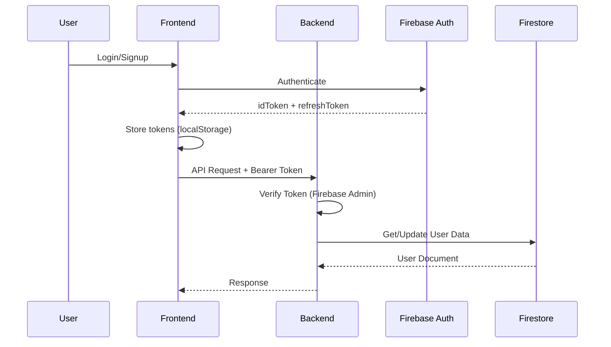
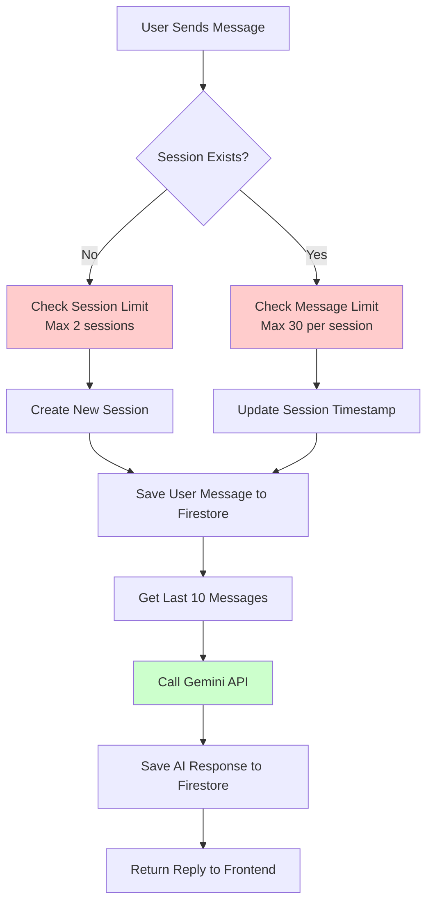
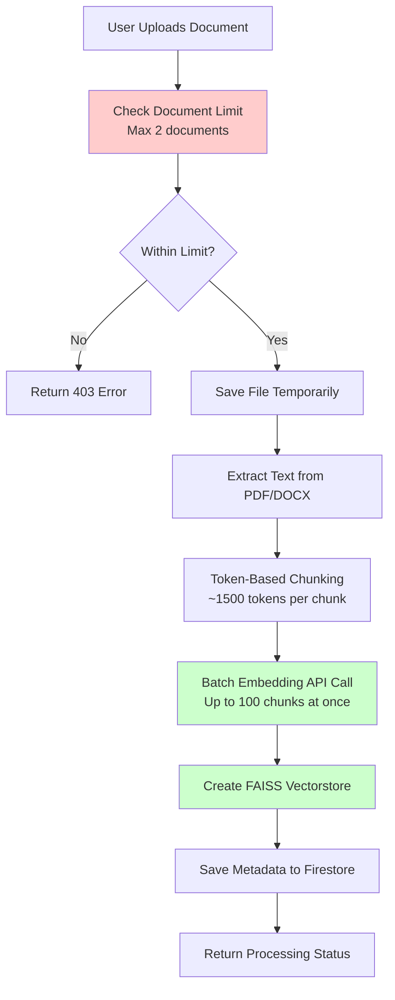
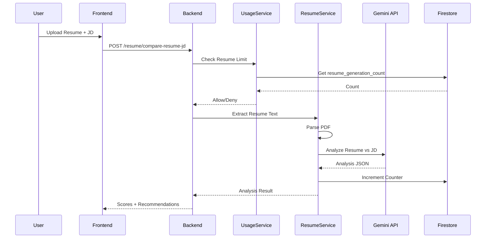
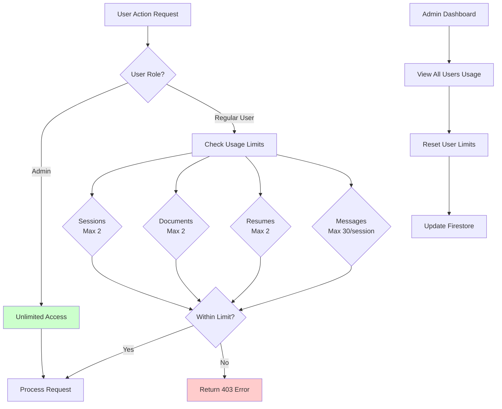
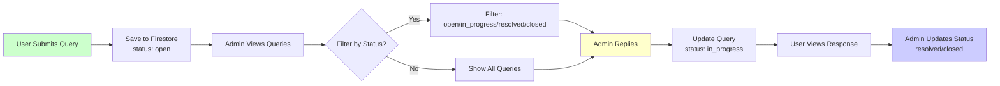
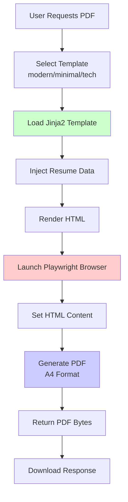
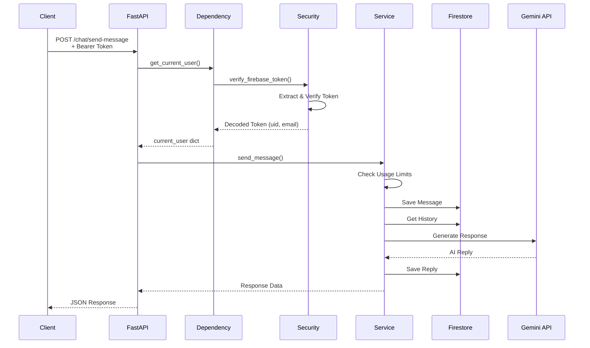

# SmartChatAI Backend

FastAPI backend for SmartChatAI - an AI-powered chat application with document analysis and resume tools.

## Features

- 🔐 **Authentication**: Firebase Auth with email/password and Google OAuth
- 💬 **AI Chat**: Conversational AI using Google Gemini with context-aware responses
- 📄 **Document Q&A**: Upload documents and ask questions using RAG (Retrieval Augmented Generation)
- 📝 **Resume Analysis**: Analyze resumes against job descriptions with detailed scoring and recommendations
- 📊 **Usage Limits**: Free tier quotas with admin management
- 🎫 **Help & Support**: Ticket system for user support
- 📄 **PDF Generation**: Generate professional resume PDFs from templates
- 🏗️ **Production-Ready**: Clean architecture with dependency injection, decorators, and service layer

## Tech Stack

- **Framework**: FastAPI
- **Database**: Google Cloud Firestore
- **Authentication**: Firebase Admin SDK
- **AI**: Google Gemini 2.5 Flash
- **Vector DB**: FAISS (for document search)
- **Embeddings**: Gemini Embeddings API (batch processing)
- **PDF Generation**: Playwright + Jinja2
- **Package Manager**: Poetry

## Application Flow Diagrams

### 🔐 Authentication Flow



### 💬 Chat Flow



### 📄 Document Upload & Processing Flow



### 📝 Resume Analysis Flow



### 📊 Usage Limits & Admin Flow



### 🎫 Help & Support Flow



### 📄 PDF Generation Flow



### 🔄 Complete Request Flow (Example: Chat)



## Project Structure

```
smartchatAI-backend/
├── app/
│   ├── __init__.py
│   ├── main.py                 # FastAPI app initialization
│   ├── config.py               # Settings management
│   ├── dependencies.py         # Dependency injection
│   ├── decorators.py           # Route decorators
│   ├── api/
│   │   ├── v1/
│   │   │   ├── auth.py         # Authentication routes
│   │   │   ├── chat.py         # Chat routes
│   │   │   ├── document.py     # Document Q&A routes
│   │   │   ├── resume.py       # Resume analysis routes
│   │   │   ├── usage.py        # Usage & admin routes
│   │   │   └── help.py         # Help & support routes
│   ├── core/
│   │   ├── security.py         # Auth utilities
│   │   ├── exceptions.py        # Custom exceptions
│   │   └── gemini_embeddings.py # Batch embedding service
│   ├── services/
│   │   ├── auth_service.py     # Auth business logic
│   │   ├── chat_service.py     # Chat business logic
│   │   ├── document_service.py # Document processing logic
│   │   ├── resume_service.py   # Resume analysis logic
│   │   ├── usage_limit_service.py # Usage quota management
│   │   ├── help_service.py     # Help ticket management
│   │   └── pdf_service.py      # PDF generation service
│   ├── models/
│   │   └── schemas.py          # Pydantic models
│   ├── db/
│   │   └── firestore_client.py # Firestore client
│   └── templates/
│       └── resume/             # PDF templates
│           ├── modern.html
│           ├── minimal.html
│           └── tech.html
├── pyproject.toml              # Poetry configuration
├── .env.example               # Environment variables template
└── README.md
```

## Setup

### Prerequisites

- Python 3.11+
- Poetry
- Firebase project with Firestore enabled
- Google Gemini API key
- Playwright (for PDF generation)

### Installation

1. **Clone the repository**
```bash
git clone <repository-url>
cd smartchatAI-backend
```

2. **Install Poetry** (if not already installed)
```bash
curl -sSL https://install.python-poetry.org | python3 -
```

3. **Install dependencies**
```bash
poetry install
```

4. **Install Playwright browser** (for PDF generation)
```bash
playwright install chromium
```

5. **Set up environment variables**
```bash
cp .env.example .env
# Edit .env with your credentials
```

6. **Activate Poetry shell**
```bash
poetry shell
```

7. **Run the application**
```bash
uvicorn app.main:app --reload
```

The API will be available at `http://localhost:8000`

## API Documentation

Once the server is running, visit:
- **Swagger UI**: http://localhost:8000/docs
- **ReDoc**: http://localhost:8000/redoc

## API Endpoints

### Authentication (`/auth`)
- `POST /auth/login` - Login with email/password
- `POST /auth/signup` - Create new account
- `POST /auth/google-signup` - Sign up with Google
- `GET /auth/me` - Get current user
- `POST /auth/update-me` - Update profile
- `POST /auth/update-password` - Change password

### Chat (`/chat`)
- `POST /chat/send-message` - Send message and get AI response
- `GET /chat/sessions` - Get all user sessions
- `GET /chat/sessions/{id}` - Get session details
- `GET /chat/sessions/{id}/messages` - Get session messages
- `DELETE /chat/sessions/{id}` - Delete session

### Document Chat (`/document`)
- `POST /document/upload` - Upload document for processing
- `GET /document/status` - Check processing status
- `POST /document/ask` - Ask question about document
- `DELETE /document/{id}` - Delete document

### Resume (`/resume`)
- `POST /resume/compare-resume-jd` - Analyze resume against job description
- `POST /resume/generate-resume` - Generate/formatted resume JSON
- `POST /resume/generate-pdf` - Generate PDF from resume data

### Usage & Admin (`/usage`)
- `GET /usage/my-usage` - Get current user's usage stats
- `GET /usage/all-users` - Get all users' usage (Admin only)
- `GET /usage/user-usage/{id}` - Get specific user's usage (Admin only)
- `POST /usage/reset/{id}` - Reset user's usage limits (Admin only)

### Help & Support (`/help`)
- `POST /help/queries` - Submit support query
- `GET /help/queries` - Get user's own queries
- `GET /help/queries/all` - Get all queries (Admin only)
- `POST /help/queries/{id}/reply` - Reply to query (Admin only)
- `PATCH /help/queries/{id}/status` - Update query status (Admin only)

## Usage Limits (Free Tier)

- **Chat Sessions**: 2 per user
- **Messages per Session**: 30
- **Documents**: 2 per user
- **Resume Generations**: 2 per user
- **Admin Users**: Unlimited access

## Development

### Code Formatting
```bash
poetry run black app/
poetry run ruff check app/
```

### Type Checking
```bash
poetry run mypy app/
```

## Performance Optimizations

1. **Batch Embeddings**: Documents are embedded in batches of 100 (70x faster for large files)
2. **Token-Based Chunking**: More accurate than character-based chunking
3. **Stateless Authentication**: No server-side session storage
4. **Efficient Queries**: Python-side sorting to avoid Firestore composite index requirements

## Architecture Highlights

- **Dependency Injection**: FastAPI's dependency system for auth and database access
- **Decorators**: Custom decorators for error handling and authentication
- **Service Layer**: Business logic separated from route handlers
- **Pydantic Models**: Request/response validation with schemas
- **Configuration Management**: Centralized settings with pydantic-settings
- **Admin System**: Role-based access control with Firestore

## License

[Your License Here]
